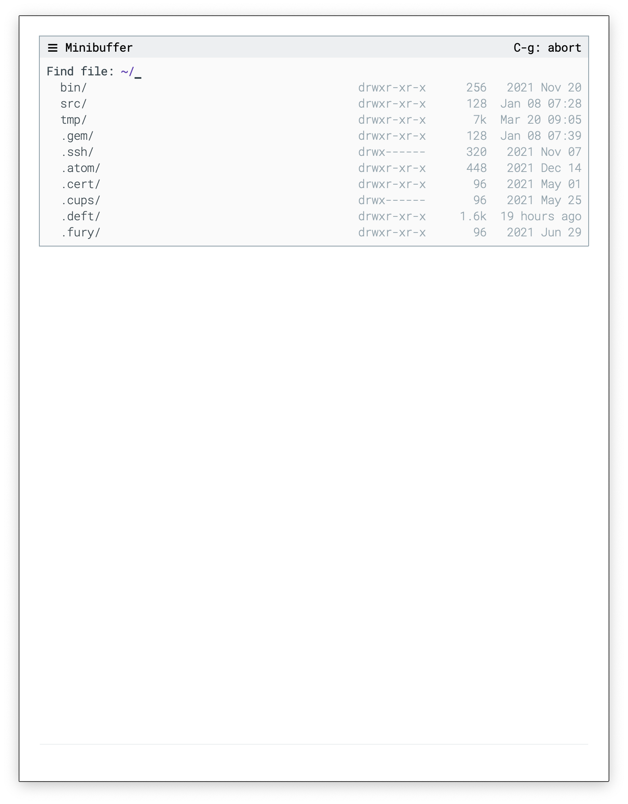
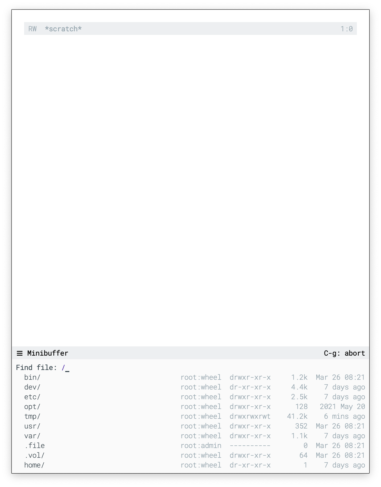

## GNU Emacs / N Λ N O Minibuffer

NΛNO minibuffer is essentially a configuration of the
[mini-frame](https://github.com/muffinmad/emacs-mini-frame) by Andrii
Kolomoiets with an overlay header line on top of the minibuffer. The
minibuffer can be placed at the top or bottom position.

